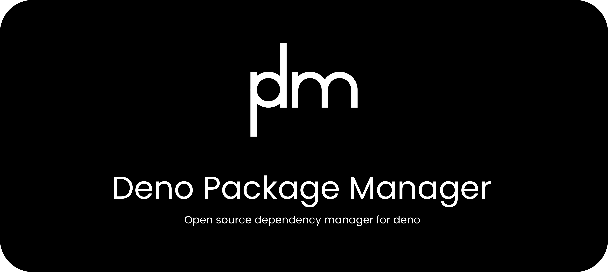

---

DPM is a fast, lightweight, rust-written package manager for Deno for those who love package managers.

# Installation

Run

```bash
make
```

```bash
sudo make install
```

# Documentation

See the documentation typing `dpm help`

```bash
Deno package manager

USAGE:
    dpm <command>

COMMANDS:
    add              Write .modules.json from package-info.json
    add <package>    Add <package> to package-info.json and .modules.json
    init             Initialize deno project
    help             Show help
    version          Show version
    create <name>    Create a new project
    run              Run the default script
    run <script>     Run the <script>

```

For more information see [wiki](https://github.com/OdilonDamasceno/dpm/wiki)


## Meta

Odilon Damasceno – [@sirskey](https://twitter.com/sirskey) – odilondamasceno@protonmail.com

Distributed under the BSD-3-Clause License. See ``LICENSE`` for more information.

[https://github.com/OdilonDamasceno/dpm](https://github.com/OdilonDamasceno/dpm/)

## Contributing

1. Fork it (<https://github.com/OdilonDamasceno/dpm/fork>)
2. Create your feature branch (`git checkout -b feature/fooBar`)
3. Commit your changes (`git commit -am 'Add some fooBar'`)
4. Push to the branch (`git push origin feature/fooBar`)
5. Create a new Pull Request